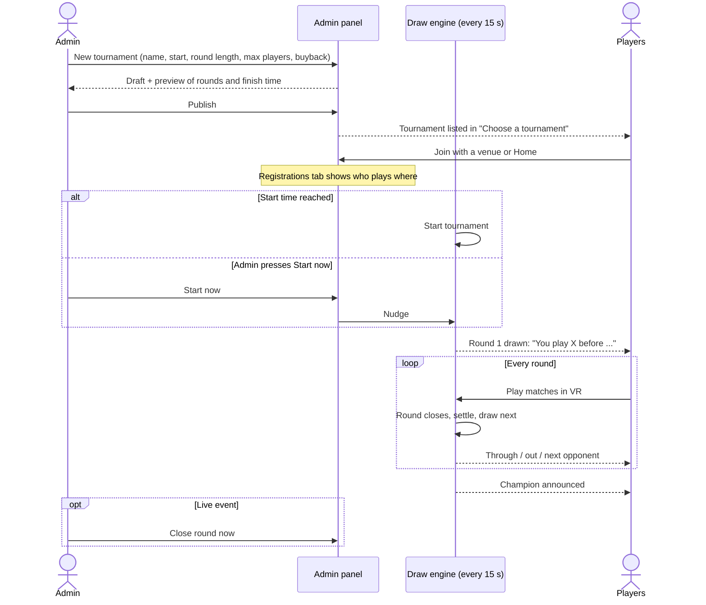

# Admin: setting up and running a tournament

```mermaid
sequenceDiagram
    actor Admin
    participant App as Admin panel
    participant Engine as Draw engine (every 15 s)
    actor Players

    Admin->>App: New tournament (name, start, round length, max players, buyback)
    App-->>Admin: Draft + preview of rounds and finish time
    Admin->>App: Publish
    App-->>Players: Tournament listed in "Choose a tournament"
    Players->>App: Join with a venue or Home
    Note over App: Registrations tab shows who plays where
    alt Start time reached
        Engine->>Engine: Start tournament
    else Admin presses Start now
        Admin->>App: Start now
        App->>Engine: Nudge
    end
    Engine-->>Players: Round 1 drawn: "You play X before ..."
    loop Every round
        Players->>Engine: Play matches in VR
        Engine->>Engine: Round closes, settle, draw next
        Engine-->>Players: Through / out / next opponent
    end
    Engine-->>Players: Champion announced
    opt Live event
        Admin->>App: Close round now
    end
```
