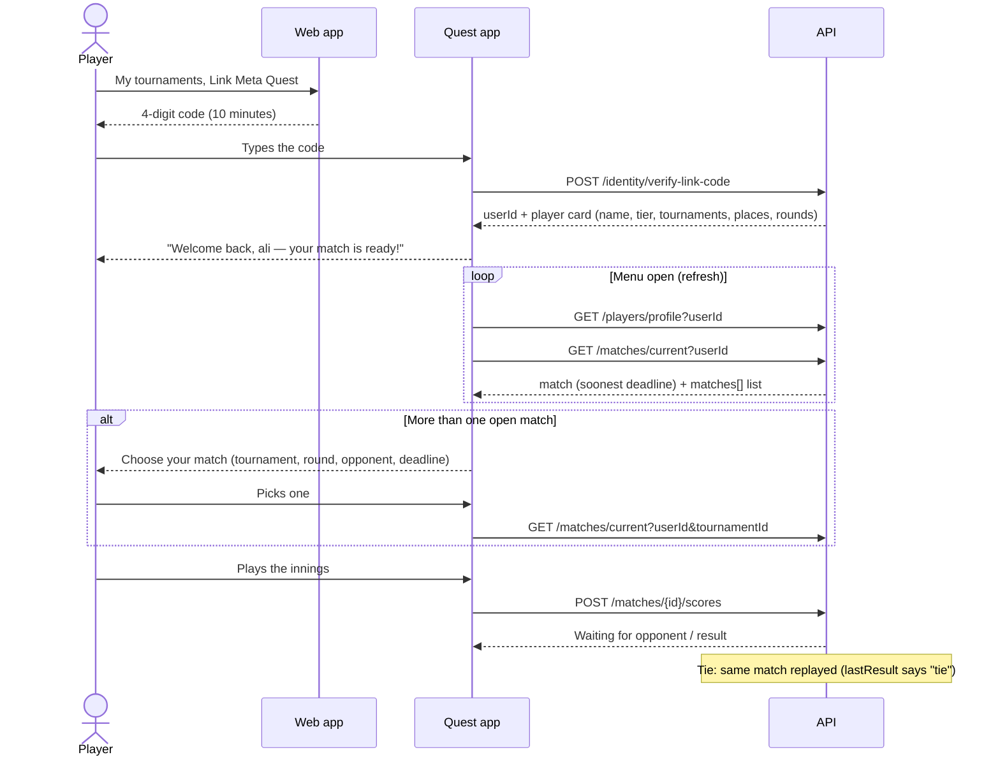

# Headset (Meta Quest)

Full contract: [Meta integration API](../integrations/meta/integration-api.md).

```mermaid
sequenceDiagram
    actor Player
    participant Web as Web app
    participant Quest as Quest app
    participant API as API

    Player->>Web: My tournaments, Link Meta Quest
    Web-->>Player: 4-digit code (10 minutes)
    Player->>Quest: Types the code
    Quest->>API: POST /identity/verify-link-code
    API-->>Quest: userId + player card (name, tier, tournaments, places, rounds)
    Quest-->>Player: "Welcome back, ali — your match is ready!"

    loop Menu open (refresh)
        Quest->>API: GET /players/profile?userId
        Quest->>API: GET /matches/current?userId
        API-->>Quest: match (soonest deadline) + matches[] list
    end

    alt More than one open match
        Quest-->>Player: Choose your match (tournament, round, opponent, deadline)
        Player->>Quest: Picks one
        Quest->>API: GET /matches/current?userId&tournamentId
    end

    Player->>Quest: Plays the innings
    Quest->>API: POST /matches/{id}/scores
    API-->>Quest: Waiting for opponent / result
    Note over API: Tie: same match replayed (lastResult says "tie")
```
